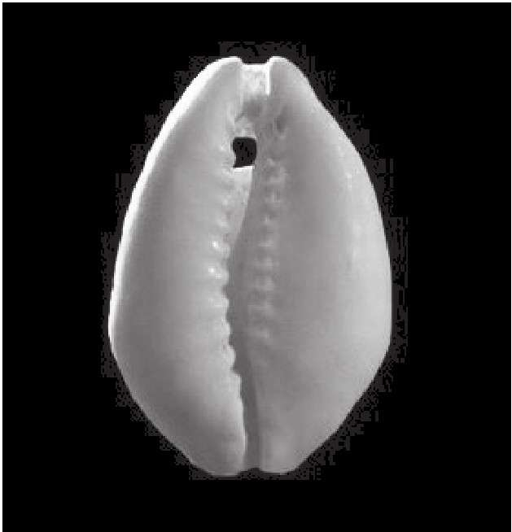
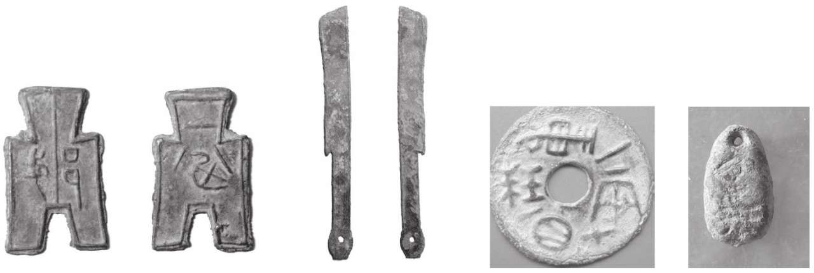
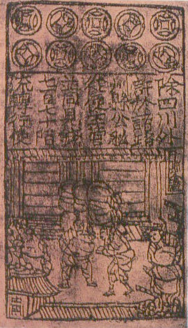

可能很多人都有过这样的疑惑：

> 比特币的发行并没有主权国家的信用背书，它有什么价值？

我们生活在法定货币的时代，使用着以国家信用背书发行的法定货币，想当然地认为“只有国家才能发行货币/只有国家发行的货币才有价值”，这其实也可以理解。

注：当然并不是国家发行的货币肯定有价值，想想委内瑞拉、阿根廷这些高通胀国家。

但我们若能回顾一下货币的历史，对历史上货币的种类以及形态有一个整体的了解，或许对上文的那个疑惑，我们能有一些不一样的思路与答案。

这阵子恰好翻阅了《货币简史》、《货币、权力与人》这两本书，故顺便针对【历史货币形态】这一点，进行归纳总结。

## 货币形态

本文主要阐述以下四种货币形态：

1. 实物货币
2. 金属货币
3. 代用货币
4. 信用货币

### 实物货币

在早期人类时期，不同部落之间会进行产品交换活动，那时候还没有所谓的货币或者一般等价物，各个部落都会将其剩余的产品拿出去与其他部落进行交换。如畜牧部落会用剩余的肉类、乳品和皮毛等与农业部落进行交换。

随着当时社会的进步以及交换行为的日益高频，物物交换的“双重偶然性”需求困扰也越来越明显。

在经历了长期的无数次的物物交换的过程中，人们逐渐发现，如果先把自己手中的商品换成一种比较容易被大多数的人接受的商品，再拿这种商品去交换自己所需要的商品，这样的交换就比较容易成功，也解决了物与物直接交换可能产生的矛盾。经过不断地筛选，人们逐渐从许多商品中遴选出一种或者几种交换频繁并得到大家接受的产品，于是，所有的商品都用这一种商品来表现价值。这种商品就是一般等价物。渐渐地在一个地域内，人们选定了相对集中的一种商品能够直接同其他一切商品交换，这样一来这种商品就成为了这个区域内的一般等价物，原来的物物交换变成了由一般等价物做为媒介的商品交换。

一般等价物与货币之间的关系问题。从一般等价物与后来人们所说的货币的本质上来看，二者其实并无实质性的区别，只是一般等价物一般不太稳定，还没有取得独立的地位。事实上，在复杂的社会经济中，要严格区分两者是困难的，因此，人类历史上这种固定地充当一般等价物的特殊商品，就是货币。

ps：现代社会的货币不属于一般等价物，若理解了上述文字，便知晓。提示(一般等价物至少是一种商品)

在古埃及，随着商品交换的日益频繁和发展，被定为执行一般等价物智能的是谷物，后来是铜块。

而在古代中国，从父系社会到夏、商时期，已经有许多商品曾经起到一般等价物的作用，比如贝壳、玉、刀、铲、弓、箭、皮、牛、马等，都曾经在不同的地区被作为一般等价物使用过。但是，由于一些物品计数不方便，有的在流通过程中容易损坏，有的笨重不便使用，逐渐被淘汰，只有贝壳始终被使用着，并到商代发展成为主要的一般等价物——货币形式。

如夏代的玄贝，商代的海贝、铜贝等。

当时贝壳之所以能成为货币形式的一般等价物，只要是因为一下原因：

- 外观优美，良好寓意（辟邪吉利）
- (中原地区)相对稀缺，易携带可计数

汉字造字的时期正是贝成为货币的时期，因此，汉字中带有价值、财富意义的字多从“贝”，如财、资、贷、货、贵、贸、贫、贡、贪等。

因此我们可以将这个阶段内的货币，归属为实物货币。

### 金属货币

人类使用过的金属货币主要有铜、铁、金、银等几种，世界上最早使用的金属货币是铜铸币，中国最早使用的金属货币也是铜币，而最早使用铜币的时代是西周时期（公元前1122年—公元前 771年），虽说是铜币，不过更多地都是以铜碎块的形状出现，到了春秋战国时期，铜铸币已经被广泛地使用，按其形状不同，可划分为布币（铲形）、刀币、圜钱和蚁鼻钱以及仿戈形的小型铜铸币等等。

据中国学者统计结论：在春秋战国时的黄金已具有价值尺度、流通手段、支付手段等职能，但是，中国先秦时期的黄金的价值却要低于白银，因为先秦时期的黄金产量要远高于白银，而且，黄金在自然界因不易同其他物质化合，虽然稀少，却比较容易开发。这就使得黄金早期的价值不仅比白银低，而且有条件成为除青铜意外的另一种重要的金属货币。

而从世界范围看，世界最早的金属货币也和中国一样，主要是铜币和金银。世界上，最早使用金属作为交换媒介的地区是古代埃及，具体时间为公元前2686—公元前2181年的古王国时期。

在西亚地区，公元前1894年创立的古巴比伦王国，已经开始大量使用白银为货币。

而在古希腊、古罗马、欧洲中世纪时期的货币基本上是围绕铜币、银币、金币为主的金属货币体系。

直至15世纪之后，随着大航海的开展，大量的白银自美洲大陆开采出来，白银成了世界贸易的主要货币。其原因是，当时已经成为世界贸易中心的明朝开放了“禁银”政策（当时白银产量有限、海盗们的大量海外白银流入中国，使得中国藏银于民），而且实质上实行了银本位制，世界由此进入了白银时代。而随着19世纪清朝经济的衰退和被推出世界贸易中心的地位，英国又开始实行金本位制，世界又进入了黄金时代。

### 代用货币

中国宋代的商品经济空前繁荣，在当时世界都是首屈一指。

当时四川地区由于自古严重缺乏铜矿，于是只能铸造铁钱用于市场交易。当时铁钱购买力很低（一匹丝绸的市价为2万个铁钱，重达130斤），这货币的困境严重地影响了四川地区经济和贸易的发展。被逼无奈的四川人，终于搞出了个具有划时代意义的金融创新——用纸币代替笨重的铁钱进行商品交易。

这种纸币就是交子。

交子其实就是一张可以填写交易数额的纸质票据，最开始由各店铺自由发行，不过后来信用得不到保证，就有成都地区的16价富商联合发行，每一张交子对应一份铁钱，100%的准备金。

后来，交子铺户在经营中发现，只动用部分存款，并不会危及交子信誉，于是他们便开始印刷有统一面额和格式的交子，作为一种新的流通手段在市场发行。

在交子在四川地区成功运行了20年后，官府看到了交子背后带来的巨大利益，同时由于部分交子铺户存在失信行为导致民间事端，于是官府接过了“交子”的发行权，但后面（1040~1042年）由于西夏皇帝李元昊亲率主力大军对宋帝国连续发起了猛烈攻击，朝廷超发“交子”用于购买军事物资，使交子兑换铁钱不断贬值，后试图发行新的纸币“钱引”来弥补财政亏空，但于事无补，最后世界上最早的纸币制度“交子”随着北宋一起灭亡，但在继送而起的元帝国和明帝国时代，纸币继续上演着激动人心的历史话剧。

到这里，我们就可以给【代用货币】下一个定义了。

> 代用货币是金属货币的代表物，它通常是由政府或银行发行代替金属货币流通使用的纸币。这种代用货币事实上是一种可流通的实质货币收据，如北宋的交子，早期的银行券。

### 信用货币

我们现在使用的法定货币，就是属于信用货币。

> 信用货币是代用货币的进一步发展物，只作为信用关系的产物，不再作为金属货币的代表物，不能与金属货币相兑换，是纯粹的货币价值符号，因而它是一种债务型货币。 

既然信用货币是代用货币的进一步发展物，那么，这一转变是如何过渡的呢？下面我们一起回顾一下：

在世界金融史上，以黄金作为本位货币的金本位制占有极为重要的地位。

金本位制经历了三种不同的形式——金币本位制、金块本位制和金汇兑本位制。其中的金币本位制是典型的金本位制。其最早于1816年在英国实行，随后，在1871年以后的30年间，包括欧美和日本各市场经济国家，都先后实行了金币本位制。

这种货币制度有三个主要特点：

其一，金币是本位货币，具有法定含金量，可以自由铸造、自由熔毁；

其二，金币可以自由流通、自由储藏，各种辅币（如铜币）和银行券可以自由兑换成金币或黄金；

其三，黄金可以自由输出或输入国境。

但是，随着第一次世界大战的爆发，维持金币本位制的必要条件——自由流通、自由兑换、自由出入国境逐渐被破坏。

一战爆发后，在整个欧洲大陆不再有金币流通，各交战国纷纷发行虽有含金量却不能兑现的国家法定纸币，从而引发严重的通货膨胀。

从而，金币本位制在世界范围内轰然崩塌了。究其原因，是因为各市场经济国家经济发展不平衡。一些经济后起的国家，如美国、德国，跳跃式地赶上并超过一些经济早先发展起来的国家，如英国、法国等。由此造成各国经济实力对比发生根本性变化。这种变化使得世界黄金储备的格局不得不重新洗牌，这更加加剧了各国黄金储备严重的不平衡。

特别是“一战”中，欧洲大陆各交战国由于支付巨额军费开支而流失了大量黄金，即使在黄金储备较多的国家，如英、法、德，也相继发生了黄金储备失衡的情况。为了避免国家经济因此而陷入更大的危机之中，各国纷纷阻止黄金自由出境，国内停止银行券兑换黄金，同时，大量发行仅有名义含金量的不兑现国家纸币，以解燃眉之急。这样一来，金币本位制的三个基础（自由流通、自由兑换、自由出入国境）就被完全破坏了。

一战结束后，各国的经济发展不平衡和黄金储备不平衡比战前更严重，一些国家被迫建立起了变相的金本位制——金块本位制和金汇兑本位制。

这两种变相的金本位制实施的后果，是取消了国内金币流通，并且限制银行券兑换成黄金，更限制黄金出境。

金块本位制只发行代表一定重量黄金的银行券，而银行券又只能在一定数量以上才能向发行银行兑换金块，英法两国先后于1925年、1928年实行了金块本位制。金汇兑本位制是指一国货币与另一个实行金币本位制国家的货币保持固定比价，并在该国存放一定数量的外汇或黄金作为平准基金，从而间接实行金本位制。

而金块本位制和金汇兑本位制随着1929年爆发的有史以来最严重的世界经济危机又被扫进了历史的风尘之中。世界性的经济危机很快诱发了世界性货币危机。由于对于黄金的挤兑和黄金外流，迫使相当一部分国家放弃金块本位制或金汇兑本位制，美国在1933年也放弃了维持了多年的金币本位制。到1936年，最后坚守金块本位制和金汇兑本位制的法国、瑞士、意大利等国家，也都最终放弃了金块本位制和金汇兑本位制。

至此，所有市场经济国家都实行了不以金银为基础的、不兑现国家纸币流通的纸币制度。

不过，为了构建起新的国际货币秩序，1944年7月，有44国参加的国际货币会议通过了《布雷顿森林协定》，建立了一个以美元为中心的国际货币体系。美国凭借它在两次世界大战期间取得的经济、政治和军事优势，开始主导国际货币秩序。

布雷顿森林货币体系的核心内容包括： 1.以黄金作为货币基础，以美元作为最主要的国际储备货币。 2.实行“双挂钩”的国际货币体系，即美元与黄金直接挂钩。当时约定的黄金官价为35美元等于1盎司黄金，其他成员国货币与美元挂钩，即按照黄金官价来确定各国货币与美元的兑换比例。 自此，各国国内货币流通已经与黄金没有了直接联系，但是，却出现了一个美元等同于黄金的局面，即为何美元有美金这一说法的缘来。

但是，由于美国自二战后的冷战中先后陷入战争（朝鲜战争、越南战争），以及欧洲诸国、日本战后恢复崛起，美国的国际收支状况逐渐恶化，美国黄金持续大量外流。1960年底，美国的黄金储备已低于其短期负债。到1970年，美国的黄金储备减少到2.5亿盎司，流失了近2/3。在此背景下，从1960年开始美元连续爆发危机，各国随即竞相抛出美元，抢购黄金，致使美元汇率不断下跌。1971年8月15日，美国政府被迫宣布停止各国央行用美元按官价向美国兑换黄金。

自此，以美元为中心，以固定汇率为特点的布雷顿森林货币体系崩溃。

1976年1月，IMF达成《牙买加协定》，该协定规定，从IMF的所有协定条款中删除过去有关黄金的一切规定。

自此，黄金不再作为国际货币体系的基础，也不再作为货币定价的标准。如此一来，在国际汇兑关系中也失去了与黄金的直接联系。

金属货币、代用货币被彻底扫进了历史风尘中，一种通过国家直接发行，没有金银背景的不兑现的国家货币制度正式建立起来了——信用货币。

### 货币形态时序

要知道的是，这些货币形态的出现并不是按照严格的时间正序，后三者更是一种不断交替出现的状态。

如北宋铜钱(金属货币)与交子(代用货币)共存，再到明朝朱元璋禁止金银铜钱的使用，一律使用既没有金属货币作为准备金，仅仅依靠朝廷的权威来保证信用价值的“大明通行宝钞”（信用货币）。

以及15世纪后，大航海时代推动下的白银本位（金属货币），到了嘉靖四年（1525年），官俸已经用白银发放，中国从此正式确立了银本位制。中国此时确立银本位制，主要是受到了世界贸易的影响。大明帝国当时已是世界贸易的中心，大明帝国确立了银本位制，也就意味着全世界确立了银本位制。而随着19世纪清朝经济的衰退和被推出世界贸易中心的地位，英国又开始实行金本位制，世界又进入了黄金时代。

### 何为货币

上文我们了解了四种历史货币形态的划分与演化，现在我们回过头思考一个问题：

> 何为货币？
>
> 或者说，货币的本质是什么？

我们知道，货币是出于人们交易的需要而产生的，是由于物物交换的不便，才促使人们选择了一种”商品“作为交换媒介(货币)，随着社会的发展，这种”商品“形态逐渐往减少交易摩擦的方向演化，从实物(牲口贝壳)、到金属(金银铜铁)、到纸质(交子、银票)，最后到信用货币（即各国法币，不代表任何实质商品或者货物，发行者也没有将货币兑现为黄金、白银等实物的义务，仅仅依靠政府的法令和强制力就足以使某种东西或物体成为合法通行的货币。）

这种货币形态的演变，其实也对应着存在两种主流的货币理论的更换：

1. 货币金属论：认为货币的本质就是商品，而金银的许多特殊的自然属性，使它最适宜于充当交换工具，其价值是由货币材料的价值所决定的。
2. 货币名目论：认为货币的本质就是一个符号，其本身没有价值，其作为货币的价值是人们集体想象的结果。

但其实我觉得货币金属论与货币名目论是交集的，即对于后者，货币的价值在于群体共识的赋予，对于前者，货币的价值在于货币材料的价值，若是对于普通商品（劳动生产物）来说，其价值是由其劳动材料成本决定，但是对于贵金属商品来说，其作为货币发挥交换媒介职能，是由于其天然属性完美符合，而内在价值还是在于人们对其的共识认可。

因此，对于货币价值的认识，我们可总结如下：

1. 货币作为货币的价值是人们想象的，是人们的主观意识。
2. 对货币价值的想象来自人们共同的意念，可以理解为一种契约的结果。
3. 正式人们对货币作为货币价值的共同想象，才使货币具有交换媒介的价值。
4. 货币作为商品的价值有劳动材料成本共同决定，货币作为货币的价值来自人们的集体想象，是集体意向性的产物。

我们承接开头的设问，大致总结出货币的基本定义：

> 任何一种能执行交换媒介、价值尺度、延期支付标准或者财富储藏手段等功能的物品，都可被看作是货币.
>
> 货币对于人类来说最重要的既不是贵金属，也不是财富，而是一种信任，一种信仰，这种信任或信仰既来自于货币本身的基本职能，更来自于货币背后所表现出来的完善的社会信任体系。

最后，响应文章开头的问题：

> 比特币的发行并没有主权国家的信用背书，它有什么价值？

当然，以上的答案铺垫也可以浓缩为两个字：【共识】。

本文就先到此为止，还有很多可以拓展的话题方向，我们留待未来再起新篇。